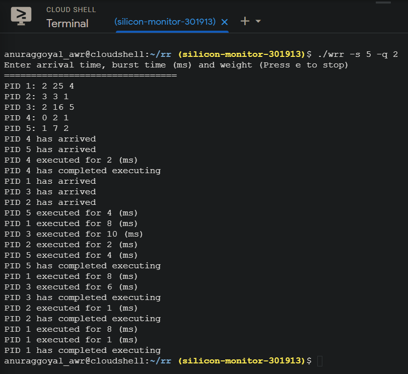
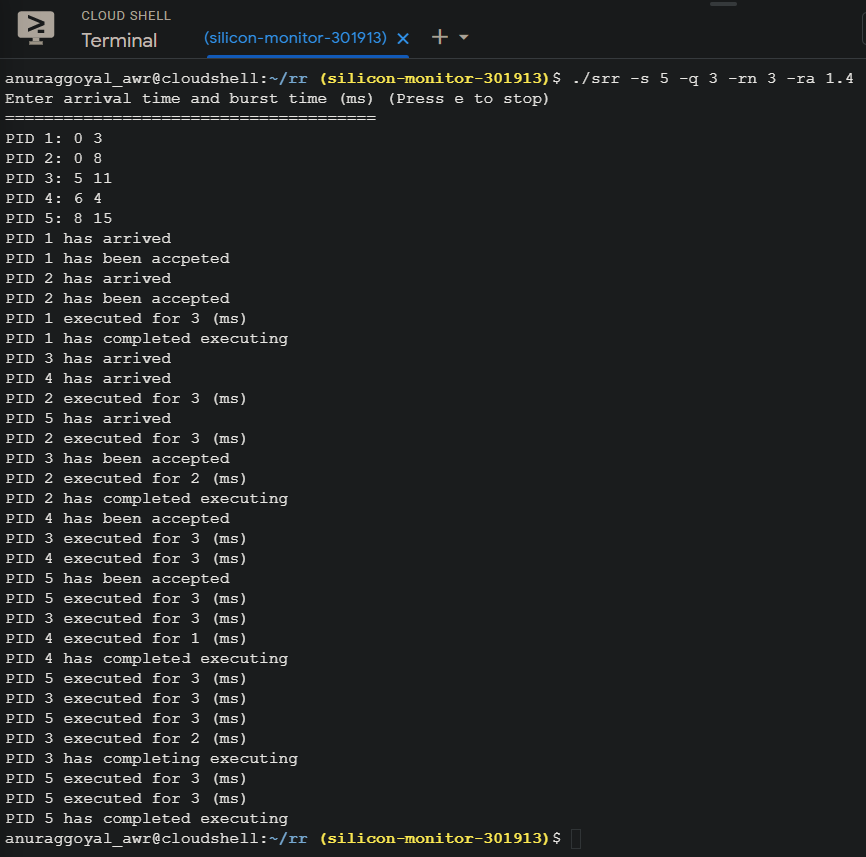

## Round Robin Process Scheduling

*Multithreaded C++ implementation of the following algorithms:*

*   Weighted Round Robin
*   Selfish Round Robin

```bash
g++ -std=c++14 -pthread <file>.cpp -o <file>
```

*Output screenshots*




